# ConvertAnything — Architecture Graph

Auto-generated view of the codebase (`/graphify .`). It shows the app as a
single-module Android project split across two execution layers:

- **Kotlin / Android layer** — Compose UI, media store access, lifecycle services,
  and the JNI wrapper. Runs in the default process.
- **C++ engine layer** — static FFmpeg + a small engine that marshals jobs by JSON.
  Heavy transcode runs in the isolated `:converter` process.

```mermaid
flowchart TB
    subgraph L1["KOTLIN / ANDROID  ·  default process"]
        direction TB

        subgraph UI["UI  ·  com.example.converanything.ui"]
            SP[SplashScreen]
            HO[HomeScreen]
            ST[StudioScreen]
            VM[StudioViewModel]
            PK[PickerScreen]
            PVM[PickerViewModel]
            QU[QueueScreen]
            VA[VaultScreen]
            VVM[VaultViewModel]
            TH[Common · Thumb / format utils]
            PNM["Permission · RequireMediaPermission"]
            TME["Theme · ConvertTheme + color tokens"]
        end

        subgraph PLAY["Playback"]
            SH[SharedPlayer · one ExoPlayer]
        end

        subgraph NI["Native sink"]
            EB[EngineBridge · JNI object + StateFlows]
        end

        subgraph DATA["Data"]
            CA[ConvertApp · Application]
            ML[MediaLibrary]
            QH[QueryHistory]
            CS[ConversionService · FGS]
        end

        subgraph CORE["Core models · com.example.converanything.core"]
            CT[ConversionTypes · types/parseTypes]
            CJ[ConversionJob · MediaItem / MediaFilter / ProbeInfo / Destination / parseJobs]
        end

        subgraph SD["Sandbox client"]
            CC[ConverterClient · Messenger + death-notice]
        end
    end

    subgraph L2["C++ ENGINE  ·  libconveranything.so"]
        direction TB
        ENG[engine.cpp · queue · workers · poll loop]
        BRG[bridge.cpp · JNI glue]
        REG[Registry · video / audio / image / video_to_audio]
        ARG[argv builder · nativeBuildArgs]
        FF[static FFmpeg 7.1.2 + x264/x265/vpx/aom/…]
    end

    subgraph L3[":converter RENDEZVOUS PROCESS"]
        direction TB
        SVC[ConverterService · Messenger server]
        FR[ffmpeg-run thread · 16 MB stack]
    end

    %% --- UI wiring ---
    MA["MainActivity · NavHost (splash/home/studio/picker/queue/vault)"]
    MA --> SP & HO & ST & PK & QU & VA
    ST --> VM & TH & SH & PNM
    PK --> PVM & TH & PNM
    QU --> TH
    VA --> VVM & TH & SH & PNM
    HO --> PNM
    PVM & VVM & VM --> ML
    ST --> VM

    %% --- data / model edges ---
    UI -- "collectAsState: EngineBridge.jobs / .types" --> EB
    UI -- "app.history.entries" --> QH
    UI -- "MediaLibrary.query / lookup / thumbnail" --> ML
    VM -- "(cast) ConvertApp.enqueue" --> CA
    QU -- "ConvertApp.library / history" --> CA --> QH
    PNM -- "MediaLibrary.requiredPermissions" --> ML
    SH -- "media3 ExoPlayer" --> UI

    %% --- sink of conversion type model ---
    CT -- "ConversionType" --> HO & ST & VM
    CJ -- "MediaItem / ProbeInfo / JobStatus" --> UI & VVM & ST & PVM & VM

    %% --- engine bridge calls ---
    EB -- "JNI: nativeEnqueue / nativeCancel / nativeSnapshot / nativeProbe / decodeThumb" --> BRG
    EB -- "parseTypes / parseJobs / parseProbe" --> CT & CJ
    CA -- "EngineBridge.enqueue + finalize(publish)" --> EB
    CS -- "collect EngineBridge.jobs" --> EB
    EB -- "jobs StateFlow" --> CS

    %% --- sandbox contract ---
    ENG -- "JNI up-call: runRemote →" --> EB
    EB -- "ConverterClient.dispatch" --> CC
    CC -- "bind + Messenger MSG_RUN" --> SVC
    SVC -- "FFmpeg thread" --> FR
    FR -- "JNI: nativeBuildArgs → nativeRunFfmpeg" --> BRG
    BRG --> ARG
    BRG --> FF
    FF --> ARG
    BRG -- "progress / stderr paths" --> FR
    FR -- "reply MSG_DONE (rc)" --> CC
    CC -- "EngineBridge.onRemoteFinished" --> EB
    CC -- "SIGKILL fallback (death → fail job)" --> SVC

    subgraph LEGEND
        direction LR
        A["StateFlow collect"] --- B["JNI native call"] --- C["Messenger / binder"]
    end
```

## Layer / flow summary

| # | Node | Responsibility | Depends on |
|---|------|----------------|------------|
| 1 | `MainActivity` | Compose `NavHost`; bottom tabs (Convert / Queue / Vault) | all screens, `ConvertTheme` |
| 2 | `ConvertApp` (Application) | Boots `EngineBridge.init`, owns `MediaLibrary`, per-job I/O + publish/finalize, `QueryHistory` | `EngineBridge`, `MediaLibrary`, `QueryHistory`, `core.*` |
| 3 | `EngineBridge` | Single JNI object; exposes `types` / `jobs` `StateFlow`s; parses JSON from C++ | `converter.ConverterClient`, `core.parse*` |
| 4 | `MediaLibrary` | MediaStore queries, thumbnails, SAF tree copy, temp/staging output files | `EngineBridge` (thumb), `core.MediaItem` |
| 5 | `ConversionService` (FGS) | Keeps process alive while jobs queued/running; idles to `stopSelf()` | `EngineBridge.jobs`, `MainActivity` |
| 6 | `ConverterClient` / `ConverterService` | Sandbox round-trip: bind → `MSG_RUN` → ffmpeg thread → `MSG_DONE`; death-notice fails job | `EngineBridge`, `native` FFmpeg funcs |
| 7 | `StudioViewModel` | Loads picker ids, probes video metadata, drives format/destination state, enqueues via `ConvertApp` | `MediaLibrary`, `EngineBridge`, `ConvertApp` |
| 8 | `PickerViewModel` / `VaultViewModel` | Media grid + filtering state | `MediaLibrary`, `core.MediaFilter` |
| 9 | `SharedPlayer` | One shared ExoPlayer object for previews/vault inline playback | media3 exoplayer/ui |
| 10 | C++ `engine.cpp` + `bridge.cpp` | Conversion queue, workers, argv build, FFmpeg execution (in-process or dispatched to sandbox) | static FFmpeg + codecs |

## Key design notes (read from source)
- **Sandbox isolation**: real ffmpeg runs in `:converter`; a native abort there only fails the job
  (death-notice path), it never takes the app process down.
- **Publish-only-after-DONE**: outputs are written to a real temp file with a proper extension and
  moved to `Downloads/ConvertAnything/…` or the user-selected tree only when the job finishes.
- **Model mirror**: `core` types (`ConversionType`, `ConversionJob`, `ProbeInfo`) are parsed from
  C++ JSON — the Kotlin registry is never hand-written, keeping both sides in sync.
- **UI never touches the engine directly**: screens read `EngineBridge` `StateFlow`s; all mutations
  flow through `ConvertApp.enqueue` / `EngineBridge` calls.
    end